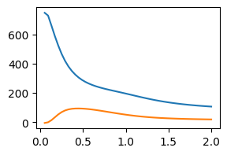

# HSIC-LK package
This package implements the HSIC with learnable kernels for statistical independence tests, as proposed in our paper AISTATS 2024. 

We provide installation instructions and an example code below showing how to use our tests. We also provide a demo notebook.

## Requirements

The requirements for the packages are:
- `python 3.7+`
  - `numpy`
  - `scipy`
  - `cupy`
  - `pytorch`

## HSIC with learnable kernels

**Statistical Independence Test.** Given the tensor $X$ of shape $(n, d_x)$ and $Y$ of shape $(n, d_y)$, our test returns $0$ if the samples $X$ and $Y$ are independence, and $1$ otherwise.
For details, check out the [demo.ipynb](./demo.ipynb)

**HSIC with Fixed Kernels.** We provide the naive implementation for HSIC with fixed kernels. Gaussian kernels as well as Laplace kernels are implemented, and for more choices of kernels, a simple modification of the code can be attempted. 

- IndpTest_naive: the naive implementation for HSIC with fixed kernels.
To use, we can import by the following.
```python
from Test.hsic_naive import IndpTest_naive
```

**Learnable Kernels.** We provide options for learnable kernels. 

- IndpTest_LKGaussian: the HSIC with Gaussian kernels (learnable widths).
- IndpTest_LKLaplace: the HSIC with Laplace kernels (learnable widths).
- IndpTest_LKWeightGaussian: the HSIC with importance-weighted Gaussian kernels.
- IndpTest_LKWeightLaplace: the HSIC with importance-weighted Laplace kernels.
- IndpTest_KSelect: the HSIC for kernel selection scenario.

To use, we can import them by the following.
```python
from Test.hsic_lkgau import IndpTest_LKGaussian
from Test.hsic_lklap import IndpTest_LKLaplace
from Test.hsic_lkwgau import IndpTest_LKWeightGaussian
from Test.hsic_lkwlap import IndpTest_LKWeightLaplace
from Test.hsic_kselect import IndpTest_KSelect
```

## Examples.

We provide a demo notebook in [demo.ipynb](./demo.ipynb).

## Figure 1 Reproduction.

To reproduce Figure 1 from the paper, please refer to [code_for_figure1.ipynb](./code_for_figure1.ipynb).

The reproduced results are shown below:

<p align="center">  </p>

Figure 1. Reproduction result corresponding to Figure 1 in the paper.
The figure demonstrates the empirical performance of the proposed independence tests under different settings.

## Bibtex

```
@inproceedings{ren2024learning,
  title={Learning Adaptive Kernels for Statistical Independence Tests},
  author={Ren, Yixin and Xia, Yewei and Zhang, Hao and Guan, Jihong and Zhou, Shuigeng},
  booktitle={International Conference on Artificial Intelligence and Statistics},
  pages={2494--2502},
  year={2024},
  organization={PMLR}
}
```

## License

MIT License (see [LICENSE.md](https://github.com/renyixin666/HSIC-LK/blob/main/LICENSE)).
